+++
title = "Comprehending CHI Coherency in gem5"
[extra]
bio = """
  Eugene Cohen is pursuing a Master's degree in Computer Science having worked in industry for a quarter century.
"""
[[extra.authors]]
name = "Eugene Cohen"
+++


# Introduction
In computer architecture classes we are introduced to cache coherency protocols like MSI, MESI, and MOESI, as well as snooping and directory-based approaches.  However, as we look at modern implementations of systems we see more complexity and different terminology.  Also, it can be difficult to map to commercial implementations as not all details are publicly visible.  This project focuses on understanding CHI, a modern cache coherent interconnect protocol and how it is used on advanced interconnect topologies.  One of the best ways to learn is to run real programs on real systems (or simulations of real systems) so in this project we execute workloads on the gem5 simulator modeling a mesh-topology interconnect that uses the CHI protocol.

The AMBA CHI Architecture Specification defines the protocol for a cache-coherent interconnect used on most ARM and many RISC-V systems. It defines a packet-based network-on-chip protocol that is used for a wide range of topologies from local subsystem interconnects to complex multi-die and multi-socket designs. The CHI interconnect relies on separate channels for requests, responses, snoops, and data transfer enabling a high degree concurrency and asynchronicity in its operations. The CHI protocol enables MESI and MOESI style coherency protocols but does so using more concise (and complex) state definitions.

The gem5 simulator enables architecture exploration by simulating different processor architectures and implementations, different cache and memories hierarchies, and different interconnect and coherency protocols with the goal of analyzing performance and correctness.  The gem5 simulator supports of an entire operating system stack (Full System Emulation - FS) or execution of standalone userspace programs (System Call Emulation - SE).  Included amongst the various topologies and coherency protocols already provided in gem5 is support for the CHI protocol.  Example system configurations for CHI are available including a simple crossbar interconnect with one directory/system-level cache as well as a more advanced 2x4 mesh topology with multiple requester, home, and subordinate nodes.

This project examines the CHI specification, following the evolution of AMBA interconnects over time, maps these concepts onto some representative commercial interconnect IPs and then seeks to reinforce these concepts by simulating programs in gem5 on a CHI mesh interconnect.  We employ a workload designed to induce coherency traffic and examine how varying workload parameters impacts system performance.

# AMBA Evolution from APB to CHI

## Specifications

| Title | Spec                             | Year | Key Features                                       |
| ----- | -------------------------------- | ---- | -------------------------------------------------- |
| APB   | Advanced Peripheral Bus          | 1997 | Simple                                             |
| AHB   | Advanced High Performance Bus    | 1997 | Multiple masters, larger bus widths                |
| AXI3  | Advanced eXtensible Interface    | 2003 | Higher perf, higher clock freq                     |
| ACE   | AXI Coherency Extensions         | 2010 | Additional signaling for system-wide coherency     |
| CHI   | Coherent Hub Interconnect        | 2014 | Redesigned transport layer for higher performance  |


## APB - Advanced Peripheral Bus

 | 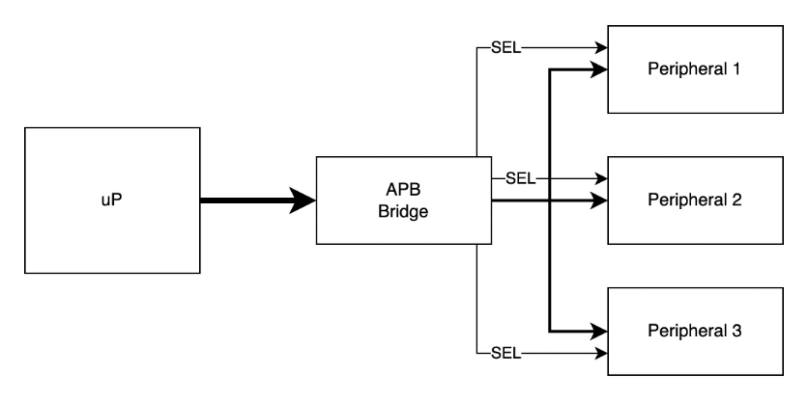 |
 | :--: |
 | *Advanced Peripheral Bus Subsystem* |

The APB bus is a shared bus parallel bus with separate select lines.  It relies on an upstream device (depicted above as an APB bridge) to decode address ranges to assert the proper select line for the peripheral.  There is only one requester from the perspective of the APB bus so there is no concept of multi-initiator operation or arbitration.

APB is a low performance bus so it does not support bursting, exclusive accesses, overlapping transactions or coherency.  The shared bus for address, data, attributes and strobes inherently limits performance and scalability but is optimal for small designs. 


## AHB - Advanced High Performance Bus

| 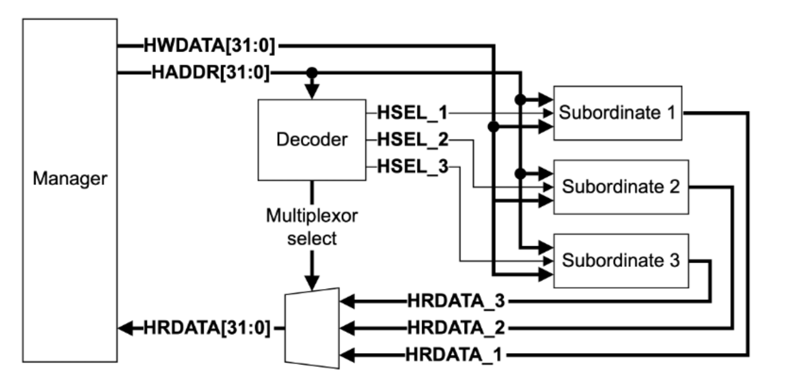 |
 | :--: |
 | *Diagram from AMBA AHB Protocol Specification* |

The AHB bus provides somewhat higher performance including support for bursts and exclusives.  It can support multiple initiators with some arbitration logic.  Like APB, the address is decoded and used to select the appropriate target device.  Additional logic is needed to select read data. There is still no support for overlapping transactions or coherency.  The AHB bus is suitable for small microcontroller cores or equivalently simple processors.  AHB could be implemented as a point-to-point or as a simple crossbar.

## AXI - Advanced eXtensible Interface

The AXI specification defines the first high performance AMBA interconnect with support for multiple outstanding transactions and out-of-order completions to requests.  The address and data phases are decoupled.  AXI supports bursting, exclusives, and QoS identifiers.  No coherency support exists in AXI.

AXI is appropriate for high performance single-core processors that do not require coherency from other system initiators such as DMA agents or other processors in a heterogenous architecture.  AXI may be appropriate for an embedded processor attachment or as an intermediate interconnect for peripherals that initiate their own transactions.

| 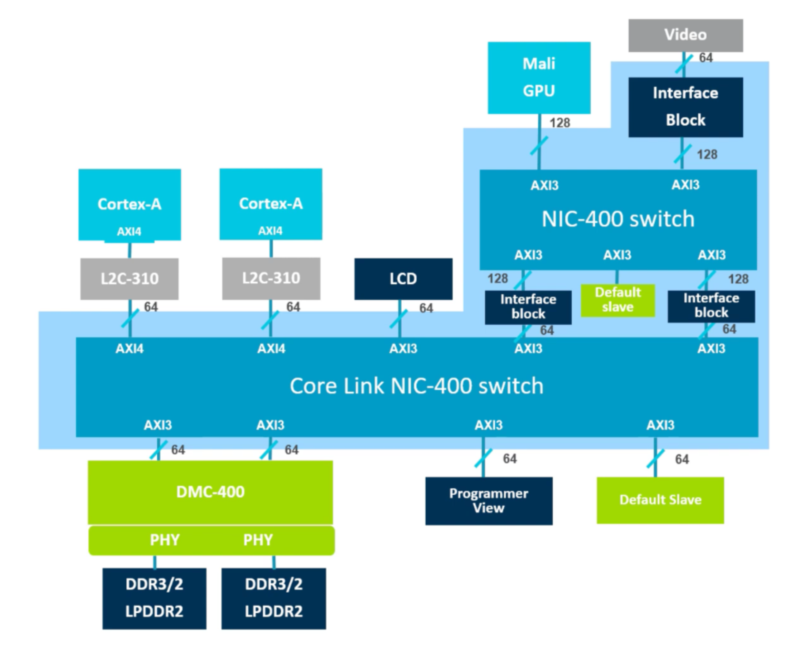 |
 | :--: |
 | *Example System using AXI, from: What is AMBA?, https://www.youtube.com/watch?v=CZlDTQzOfq4* |


### AXI4 Transaction Attributes

It's worth taking a moment to study the transaction attributes for AXI.  Any initiator of a transaction drives attributes that describe the treatment of the transaction for the purposes of ordering, buffering, caching and protection.  While this is only an interconnect specification, these attributes align with the ARMv7 architecture memory model definitions.

The **AxCACHE** signals determine the ordering, buffering and cacheability treatment for the transaction.  We divide these into cacheable and non-cacheable categories and then subdivide based on the buffering and ordering treatments.

| Cacheability  | Type                   | Early Ack? | Mergeable?  | Prefetchable? | Example                        |
| ------------- | ---------------------- | ---------- | ----------- | ------------- | ------------------------------ |
| Non-Cacheable | Device Non-Bufferable  | No         | No          | No            | Strongly Ordered MMIO Register |
| Non-Cacheable | Device Bufferable      | Yes        | No          | No            | Weakly Ordered MMIO Register   |
| Non-Cacheable | Normal Non-Bufferable  | No         | Yes         | No            | Strongly Ordered Shared Mem    |
| Non-Cacheable | Normal Bufferable      | Yes        | Yes         | Yes           | Weakly Ordered Shared Mem      |
| Cacheable     | Write-through + NA     | Yes        | Yes         | Yes           | Framebuffer or Other DMA Buf   |
| Cacheable     | Write-through + RA     | Yes        | Yes         | Yes           | Framebuffer or Other DMA Buf   |
| Cacheable     | Write-through + WA     | Yes        | Yes         | Yes           | Framebuffer or Other DMA Buf   |
| Cacheable     | Write-through + RWA    | Yes        | Yes         | Yes           | Framebuffer or Other DMA Buf   |
| Cacheable     | Write-back + NA        | Yes        | Yes         | Yes           | Main memory                    | 
| Cacheable     | Write-back + RA        | Yes        | Yes         | Yes           | Main memory                    |
| Cacheable     | Write-back + WA        | Yes        | Yes         | Yes           | Main memory                    |
| Cacheable     | Write-back + RWA       | Yes        | Yes         | Yes           | Main memory                    |
----

Allocation Hints:
* NA - no allocate
* RA - read allocate
* WA - write allocate
* RWA read & write allocate

As we can see the transaction attributes are expressive as it pertains to the treatment of the transaction.


## ACE - AXI Coherency Extensions

The first time we see coherency support in the series of AMBA specification is ACE, AXI Coherency Extensions.  Why do we focus on ACE when the goal is to learn CHI?  The concepts introduced in ACE continue on into CHI and as a learning vehicle it's simpler to learn in the context of ACE than will the full complexity of the latest CHI specification.

It's interesting that coherency support did not require a replacement of AXI but simply could be layered on top of AXI.  The way this is accomplished is by adding additional signals (DOMAIN, SNOOP, and BAR) alongside the standard AXI ones to apply additional attributes each transaction request.  In addition to added signal for transaction attributes an additional SNOOP channel is defined to allow the interconnect to send snoop and cache management requests into requesters.


|  |
 | :--: |
 | *Example System using ACE, from ARM CoreLink CCI-400 TRM* |


With ACE we can now build a system where caches can be snooped and invalidated enabling multiprocessing with shared memory (full coherency).  A subset of ACE called ACE-Lite is defined as well to enable coherency from IO devices initiating transactions that are expected to snoop processor caches but the IO devices themselves do not have any snoopable caches of their own (IO coherency, or one-way coherency).

In addition to all of the cache coherency goodness we see other concepts necessary for performant multiprocessing emerge.

ACE defines a set of transactions to enable Distributed Virtual Memory, or DVM.  While this sounds fancy DVM messages are required to enable efficient invalidations of virtual memory addresses across multiprocessors, namely TLB invalidates (after pagetable updates) and instruction cache invalidation (code loading or JITters).

ACE also defines a set of barrier messages to enable synchronization between weak/relaxed ordered operations.


### ACE/CHI Cache States

ACE and CHI employ a cache state model that allows MOESI style coherence but using entirely different terminology.  Fortunately the terminology is more concise than MOESI so it's easier to reason about the meaning.


| 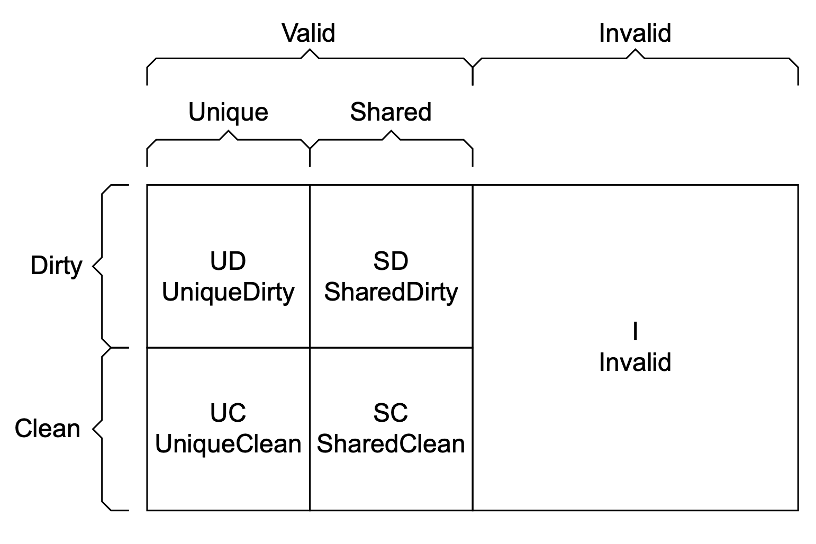 |
 | :--: |
 | *ACE Cache States, from AMBA AXI and ACE Protocol Specification* |


The cache states are as follows:

---
* Invalid: Cache line not present in cache
---
* Unique: Cache line only exists in one cache
* Shared: Cache line might exist in more than one cache
---
* Clean: This cache not responsible for updating main memory
* Dirty: This cache is responsible for updating main memory
---


### ACE/CHI Transactions

Where complexity really starts to emerge are in the various transaction types.  These transactions encompass the desired treatment of the data as far as whether caches should be accessed at all (NoSnoop), what state the initiator's caches will end up in, and the expected state of the target caches.  There are also transactions that are used for programmatic cache maintenance (e.g. "please flush these addresses to memory") and even transactions that are intended to provide visibility to upstream snoop filters (Evict).

The *intent* of these transactions can be difficult to find - for example a ReadShared is used for a Read but a ReadUnique or MakeUnique is used to prepare for a write!

To help manage this complexity it's useful to map the transaction types to typical use cases as shown below.

#### ACE/CHI Transactions from Processor to Interconnect (Read/Write Requests)
| Transaction | Meaning | Typical Use |
| --- | --- | --- |
| ReadNoSnoop | Read, with no snooping/coherency with other nodes | Non-coherent memory or mmio access |
| WriteNoSnoop | Write, with no snooping/coherency with other nodes | Non-coherent memory or mmio access |
| ReadOnce | Read, initiator will not cache, ends in invalid state | Snapshot of data, non-temporal/non-spatial |
| ReadClean | Read, initiator ends in clean state | Write-through cache |
| WriteClean | Write, initiator ends in clean state | Speculative writeback |
| ReadNotSharedDirty | Read, unique-dirty OK, but shared-dirty not OK | Data load or instruction fetch |
| ReadShared | Read, all states OK | Data load or instruction fetch |
| ReadUnique | Read, initiator ends in unique-clean/dirty state | Prep for partial cache line store, initiator doesn’t have cache line |
| WriteUnique | Write, initiator ends in shared-clean state | Initiator without cache (e.g. IO) writing |
| CleanUnique | Clean other caches, initiator ends in unique state | Prep for partial cache line store, initiator already has cache line |
| CleanShared | Clean all caches | Explicit cache maintenance instructions in program |
| CleanInvalid | Clean and invalidate all caches | Snoop filter back-invalidation |
| MakeUnique | Remove other copies, initiator ends in unique-dirty | Data store miss of full cache line |
| MakeInvalid | Invalidate all caches | Explicit cache maintenance instructions in program |
| Evict | Indicates cache line has been evicted | No data transfer, only provides visibility to a snoop filter |
| WriteEvict | Write clean cache line to lower cache level | Eviction of clean cache line down the hierarchy |


Similarly we can map transactions arrive at a coherent node on the Snoop channel.

### ACE/CHI Transactions from Interconnect to Processor (Snoop Requests)
| Transaction | Meaning | Typical Use |
| --- | --- | --- |
| ReadOnce | Snoop read, initiator will not cache | Enable the snooped processor to retain cacheline in unique state |
| ReadClean | Snoop read | Initiator has a write-through cache |
| ReadShared | Snoop read, snooped to shared-dirty or shared-clean | Initiator data load or instruction fetch |
| ReadNotSharedDirty | Snoop read, snooped to shared-dirty or invalid | Initiator data load or instruction fetch |
| ReadUnique | Snoop read, snooped must end in invalid state | Prep for partial cache line store, initiator doesn’t have cache line |
| CleanInvalid | Clean and invalidate all caches | Explicit cache maintenance instructions in program |
| MakeInvalid | Invalidate all caches | Explicit cache maintenance instructions in program |
| CleanShared | Clean all caches | Explicit cache maintenance instructions in program |


### ACE Coherency Responses

Although the transaction types indicate the initiator's desired end state, that's not the full story.  The responder also has a say on the final state and can choose to pass ownership for writing back data or can indicate if the snooped is in a shared state.

**PassDirty**
The node receiving this response gains responsibility for writing back the modified cacheline
If set, resulting state will be UniqueDirty or SharedDirty

**IsShared**
Indicates the returned data may be held in another cache
If set, resulting state will be SharedClean or SharedDirty

Some interesting scenarios can arise here - if a requester wants a clean line and a responder passes a dirty response then it's the interconnect's job to resolve this situation by writing data back to main memory *and* providing a clean response back to the requester.

### ACE/CHI Snoop Filter

If the interconnect were to send snoop requests to every cache in the system we would see performance degradation due to excessive snoop traffic on the interconnect as well as excessive cache lookups as they check for matching addresses.

In computer architecture classes we learn about the directory methodology for coherence, where a directory (or set of directories) track the node IDs on a per-cache block basis.  In essence an ACE/CHI Snoop Filter is conceptually the same, except we treat the Snoop Filter more like a cache than a directory.  The snoop filter will allocate an entry for any block address in an upstream cache so it can decide whether to forward coherency requests upstream or to ignore them.  In this case an entry simply consists of an address corresponding to the cache block - so it's equivalent a cache itself with a tag and a valid bit but no data.

|  |
| :--: |
| *ACE System Using a Snoop Filter, from ARM CoreLink CCI-550 TRM* |

Ideally, the Snoop Filter is configured with enough entries to track the state of all "upstream" cache blocks.  This means that snoop filter sizing must take into account all attached caches for optimal performance.

For example the ARM CCI 500 TRM advises: 

> Arm recommends that you configure the snoop filter directory to be 0.75-1 times the total size of exclusive caches of > ?> processors that are attached to the CCI-500. The snoop filter is 8-way set associative and, to minimize conflicts, stores > twice as many tags as the configured size.

So what happens if a snoop filter runs out of space?  It's not acceptable for the snoop filter to be out of sync from upstream caches as it would break the coherence protocol so instead the snoop filter itself will initiate an eviction from an upstream cache, called a back-invalidation.  This is something important to consider when sizing resources in a memory hierarchy as any benefit from larger caches on your processor can be negated by insufficient snoop filter sizing!

* Reduce coherency broadcasts
* Track tags from upstream caches
  * A cache of tags without data
  * If capacity exceeded, perform a back-invalidation in upstream caches
* Only issue snoop transactions in case of a filter hit
* Requires additional ACE coherency messaging to maintain filter state
  * like Evict to inform filter when lines are invalidated due to capacity


## CHI

The CHI specification builds on AXI and ACE.  It defines a layered architecture enabling
distinct link layers with packets (Flits) riding on top.  It enables a network of nodes including arbitrarily complex topologies including rings and meshes as well as aligning to physical topologies like die-to-die and socket-to-socket topologies.


| 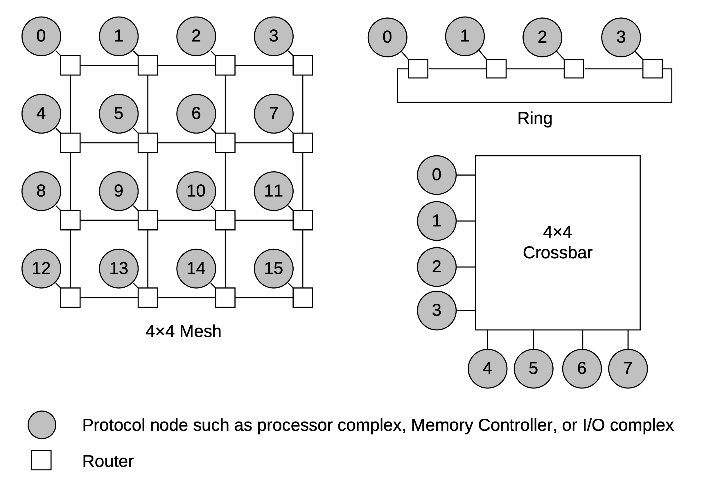 |
| :--: |
| *Example CHI Topologies, from CHI Architecture Specification* |

CHI introduces formal concepts for coherency (Point of Coherency), ordering (Point of Serialization), persistence (Point of Persistence), and encryption (Point of Encryption).

Key in the CHI architecture are the roles that nodes take on.  Instead of previous generations which depicted a monolithic interconnect that could magically host caches or directories/snoop filters, CHI formalizes the relationship between the nodes with caches, nodes that manage coherency for a portion of the address map, and nodes that serve as targets for main memory accesses.

| 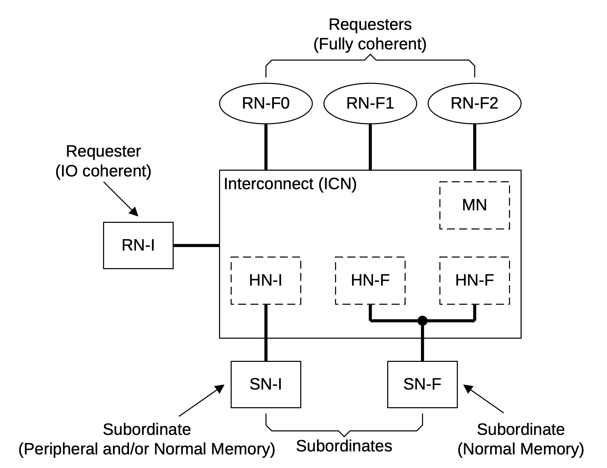 |
| :--: |
| *CHI Node Examples, from CHI Architecture Specification* |

The first category of nodes is "Requester" which may have caches (RN-F, F meaning fully coherent) or may not have caches (RN-I, I meaning IO).

The second category of nodes is "Home" which, for addresses corresponding to cacheable memory (HN-F, meaning fully coherent) typically marks the Point of Coherency for some subset of the address space and can host system-level caches.  There is also a category of Home nodes for IO requests (HN-I) - no coherency to worry about here but the HN-I still services a role in ordering requests.

The last major category of nodes is the "Subordinate" which, for coherent addresses will host a memory controller or a bridge to some other memory target.

How does an RN know which HN node ID to talk to?  Conceptually there is a Requester-Node System Address Map (RN-SAM).  For performance reasons this SAM is usually co-located with the RN.  Similarly, how does an HN know which SN node ID to talk to?  It's another address map, the Home Node System Address Map (HN-SAM). 

Both the RN-SAM and HN-SAM can define interleaving to spread traffic across destinations.  RN-SAMs can interleave addresses across System-Level Caches and, indirectly Memory Controllers, and HN-SAMs can interleave addresses across multiple memory controllers serving that one HN.

### Basic CHI Flow

The flow of transactions originates from an RN, targets an HN and then can proceed many places in the system depending on where the data resides.  Consider a case where we are performing a coherent data read from RN-F0.

1. RN-F0 looks in the RN-SAM and gets the node ID for the HN-F, say HN-F0.
2. HN-F0 gets the request and checks if its local SLC slice has the data.  If not it checks its snoop filter to see if any upstream RN-Fs have the data
3. HN-F0 determines from its snoop filter than RN-F1 has the data.  HN-F0 issues a read to RN-F1.
4. RN-F1 performs the read and replies.  CHI includes an optimization where these responses can be sent direct to the requester node and bypass the intermediate home node.

It's also possible that the address is not in any cache and the HN-F would:

3. Look in the HN-SAM to find the node ID for the SN-F, say SN-F0.
4. SN-F0 performs the read and replies.  

Now that we have a basic understanding of CHI topologies and coherence we can move on to some real (but simulated) systems and workloads.

# Analyzing CHI Coherency Performance with gem5

## Environment

A build environment was created on an Ubuntu 24.04 host using a docker container for building and executing gem5.  The gem5 git repo (tag v24.1.0.2) was cloned.  Since gem5 already provides a Dockerfile no special detective work was required to find dependencies.

## Configuring gem5

Two different emulation modes are provided with gem5.  The Full System emulation (FS) will emulate an entire machine from its reset vector enabling execution of boot firmware (like ARM TF-A or RISC-V OpenSBI) and then booting into a full OS.  This capability is important for projects that require OS interaction or modifications like memory management, scheduler work and any specialized driver or HAL/BSP type of work.

For the CHI coherency project we started exporting FS mode and it was observed that a single Ubuntu boot takes multiple hours to complete (RV64 with a simple timing cpu model).  A rough comparison of performance is that about 3 seconds of OS boot execution corresponded to over an hour of simulation.  For Linux, it is possible to bypass the initialization of the OS distro and boot from a kernel and then set init to run /bin/bash but cycle times are still very slow compared to SE mode (below).  Given this performance would hamper any meaningful development we explored other modes of development.

The other mode of operation supported by gem5 is Syscall Emulation (SE).  In this mode user-space applications are executed and any time a call is made to an OS kernel the call is intercepted by gem5 and handled natively on the host.  This has the benefit of a major performance improvement over FS because with SE you can skip the OS boot process and begin executing the first program opcodes within a few seconds.  A downside of SE is that it does not match the OS behaviors for interacting with hardware which for an architectural simulator can be important when it comes to things like utilization of caches, TLBs and memory.  The Syscall Emulation mode also requires that syscalls that appear in programs are well-supported in gem5.  If a new syscall is added to, say, the Linux ABI then gem5 will need to be updated to faithfully handle (or sometimes ignore) the syscall so the program can function.


## Syscall Emulation

We began exploring SE mode for emulating the Linux kernel ABI and needed to confirm that SE would be capable of handling multiprocessing in one program - sending threads to other cores so we can see the appropriate interconnect and coherency effects.  Fortunately the gem5 source tree includes a basic multiprocessing test called 'threads' which distributes a matrix multiplication across all detected CPU cores.  It turns out that running this simple threads test exposed a deficiency in the capability of SE mode on some architectures.


### Building Thread Test
By default this is only built for x86 but the makefile at tests/test-progs/threads/src/Makefile can be adjusted to add ARM and RISC-V architectures:

```
../bin/arm/linux/threads: threads.cpp
	aarch64-linux-gnu-g++ -static -o ../bin/arm/linux/threads threads.cpp -pthread -std=c++11

../bin/riscv/linux/threads: threads.cpp
	riscv64-linux-gnu-g++ -static -o ../bin/riscv/linux/threads threads.cpp -pthread -std=c++11
```

Note the -static switch - without this a dynamic library will be built and if you are running cross-architecture some difficult dynamic library path fixups will be required.


### SE Pitfalls

Initially the intent was to use the ARM processor architecture for the CHI coherency work because it seemed like the most natural fit - the AMBA CHI specification originates from ARM, ARM products have the longest history with CHI, and the gem5 build for ARM selects CHI as it's default coherency protocol.  So with an ARM variant of gem5 built, we tried to execute the 'threads' program in SE mode and it immediately failed.

```fatal: Syscall 435 out of range```

We inspected the syscalls supported in the gem5 source.  The syscall support is both OS- and architecture-specific.  For our ARM Linux case, we examined `src/arch/arm/linux/se_workload.cc`.

So for our failing syscall 435 we can examined the syscall emulation table for 64-bit ARM linux:

```
class SyscallTable64 : public SyscallDescTable<EmuLinux::SyscallABI64>
...
        {  base + 292, "io_pgetevents"},
        {  base + 293, "rseq", ignoreWarnOnceFunc },
        {  base + 294, "kexec_file_load"},
        { base + 1024, "open", openFunc<ArmLinux64> },
        { base + 1025, "link" },
        { base + 1026, "unlink", unlinkFunc },
        { base + 1027, "mknod", mknodFunc },
```

and as we see there's a gap that skips over 435.

How do we know what 435 means?  We could just look at glibc or linux kernel source code or through searching we can find a [quick reference](https://www.chromium.org/chromium-os/developer-library/reference/linux-constants/syscalls/#aarch64_435) from the chromium project (chromium runs on the linux kernel, so that's ok).  From this reference we see this is the clone3 syscall.  This is a series of syscalls that implements fork-like functionality as we can see from the [clone3 man page](https://man.archlinux.org/man/clone3.2.en).

How is it that a test included in gem5 fails on an architecture supported in gem5 SE?  This is likely due to the fact that the C library (glibc/libstdc++) was updated at some point to change the underlying implementation for creating new threads.  The threads program does not call fork or clone directly, it uses the C++ standard threading library (std::thread) which, in turn selects the underlying syscall.  So simply by changing compilers we can select newer version of libraries that can make syscalls in a new way.  This means gem5 maintainers have a difficult job as they need to chase updates in libraries as they are made (or in our case, not).

Interestingly, for the clone3 syscall there is support present in gem5 for *other* architectures, specifically X86 and RISC-V::

```
src/arch/x86/linux/syscall_tbl64.cc:    { 435, "clone3", clone3Func<X86Linux64> },
src/arch/riscv/linux/se_workload.cc:    { 435,  "clone3", clone3Func<RiscvLinux64> },
src/sim/syscall_emul.hh:clone3Func(SyscallDesc *desc, ThreadContext *tc,
```

This led to the broader question - what other syscalls might we be missing?  Since we are building a plain linux executable, we can run it on a different machine and use strace under linux (the full OS this time) to trace syscall usage.  On an arm64 host/vm/qemu we launch the command under strace thusly:

```strace -n -o strace.txt ./threads```

and thanks to the -n switch we can see the syscalls including syscall number:

```
[ 134] rt_sigaction(SIGRT_1, {sa_handler=0xfd15ae0c2840, sa_mask=[], sa_flags=SA_ONSTACK|SA_RESTART|SA_SIGINFO}, NULL, 8) = 0
[ 135] rt_sigprocmask(SIG_UNBLOCK, [RTMIN RT_1], NULL, 8) = 0
[ 222] mmap(NULL, 8454144, PROT_NONE, MAP_PRIVATE|MAP_ANONYMOUS|MAP_STACK, -1, 0) = 0xfd15ad600000
[ 226] mprotect(0xfd15ad610000, 8388608, PROT_READ|PROT_WRITE) = 0
[ 135] rt_sigprocmask(SIG_BLOCK, ~[], [], 8) = 0
[ 435] clone3({flags=CLONE_VM|CLONE_FS|CLONE_FILES|CLONE_SIGHAND|CLONE_THREAD|CLONE_SYSVSEM|CLONE_SETTLS|CLONE_PARENT_SETTID|CLONE_CHILD_CLEARTID, child_tid=0xfd15ade0f230, parent_tid=0xfd15ade0f230, exit_signal=0, stack=0xfd15ad600000, stack_size=0x80ea20, tls=0xfd15ade0f8a0} => {parent_tid=[36110]}, 88) = 36110
[ 135] rt_sigprocmask(SIG_SETMASK, [], NULL, 8) = 0
[ 222] mmap(NULL, 8454144, PROT_NONE, MAP_PRIVATE|MAP_ANONYMOUS|MAP_STACK, -1, 0) = 0xfd15acc00000
[ 226] mprotect(0xfd15acc10000, 8388608, PROT_READ|PROT_WRITE) = 0
[ 135] rt_sigprocmask(SIG_BLOCK, ~[], [], 8) = 0
```

and cross-reference this to gem5's syscall emulation table

#### Switching from ARM to RISC-V SE

We ported clone3 syscall support from RISC-V to ARM and were able to successfully execute the threads program, however the number of cores detected was incorrect.  Digging into this deeper there was another deficiency in syscall emulation around handling special files used by glibc to detect the number of processor cores via special filesystem paths like `/sys/devices/system/cpu/online`.

This raised a question - is it possible that other architectures have better SE/syscall support than ARM?  The same threads program was built and tested under gem5 in RISC-V mode and worked the first time with proper clone3 handling and the correct detection of number of CPU cores.  This led us to conclude that the ARM architecture is not being maintained quite as well in 2025 as X86 and RISC-V.  Since it is possible for CHI to be used with other architectures we switched from ARM to RISC-V at this point.


#### Build gem5 for RISC-V with CHI Coherency

 The default coherency protocol for gem5 for RISC-V is not CHI so we needed a way to get RISC-V and CHI working together.  Although most aspects of the system construction can be changed when starting gem5 without rebuilding it, switching to a different coherency protocol requires a specialized build configuration for gem5.  We had to create a new gem5 configuration file, placed at build_opts/RISCV_CHI which specifies that we want RISCV but also to use RUBY and the CHI coherency protocol:

```
RUBY=y
PROTOCOL="CHI"
RUBY_PROTOCOL_CHI=y
BUILD_ISA=y
USE_RISCV_ISA=y
```

We then built this RISCV_CHI variant and used it for the project.


# CHI Topology Configuration in gem5

With the project focused on understanding CHI coherency we explored the interconnect topology options already present in gem5.  For CHI, the following configurations are supported:
* Crossbar
* Pt2Pt
* CustomMesh

### Pt2Pt

The point-to-point is a single interconnect with direct connectivity between all nodes.  The  concept implies that requests can traverse the interconnect without having to wait for transaction buffer resources and without incurring additional hops along the way.

| 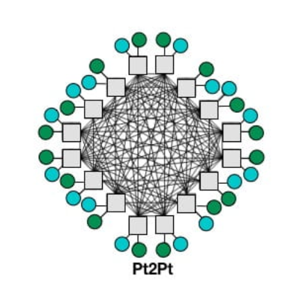 |
| --|
| from [gem5 Interconnection Network](https://www.gem5.org/documentation/general_docs/ruby/interconnection-network/) documentation |

### Crossbar

Practically speaking an everything-to-everything topology is not realistic.  A common approach for small interconnects is a crossbar where the interconnect contains a crossbar switch allowing simultaneous streams of communication between separate initiators and targets.  The crossbar switch is itself a constrained resource because it is limited by internal connectivity and internal queues/FIFOs resources.

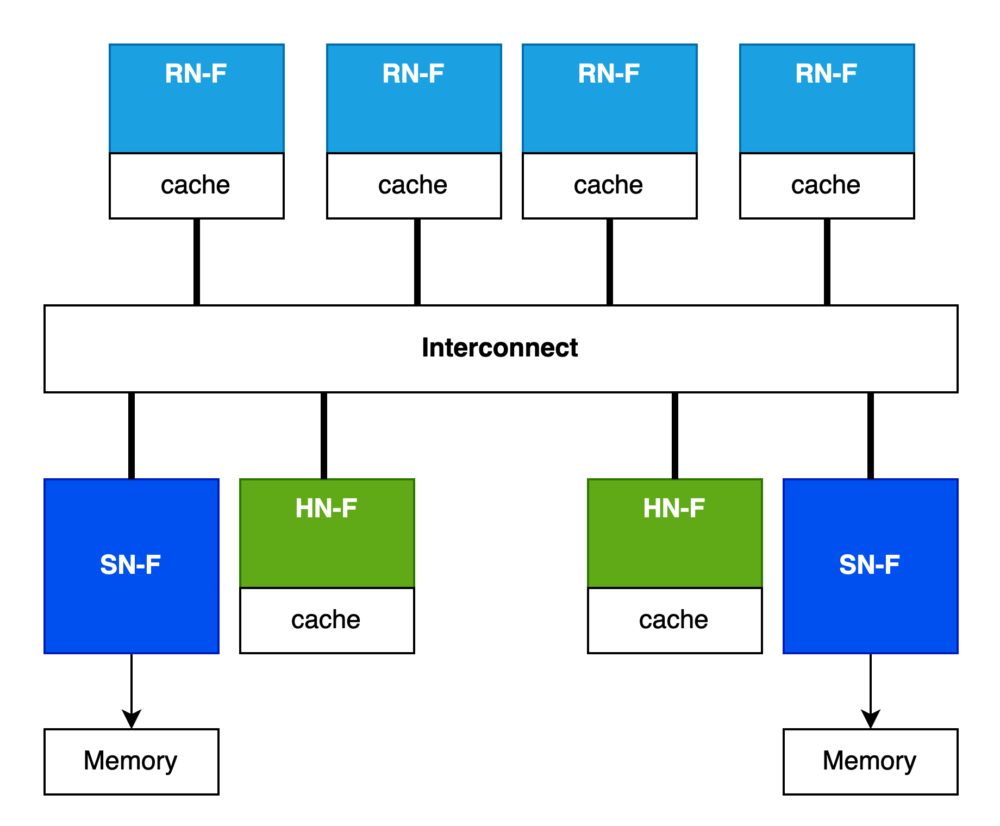

For small/local interconnects the crossbar is a reasonable solution but for larger systems a is not practical and the crossbar switch cannot scale to larger numbers of initiators and targets in the system, both logically and physically.  If we think of a 128-core server SOC with dozens of PCIe and memory controllers we can see that something different is needed.


### Mesh
CustomMesh means that the topology is loaded from a file describing the interconnect configuration.

gem5 includes an example 2x4 custom mesh topology file (2x4.py) which defines the locations of node types in the mesh pattern, primarily RNFs for processors, HNFs for directories and system-level caches (SLCs) and main memory SNFs for memory controllers.

Mesh dimensions are defined as rows and columns:
```
class NoC_Params(CHI_config.NoC_Params):
    num_rows = 2
    num_cols = 4
```

and which then implies mesh position numbers:
```
 0 --- 1 --- 2 --- 3
 |     |     |     |
 4 --- 5 --- 6 --- 7
```
from here nodes are mapped onto the mesh, for example RNFs (processors) are mapped to the inside positions:
```
class CHI_RNF(CHI_config.CHI_RNF):
    class NoC_Params(CHI_config.CHI_RNF.NoC_Params):
        router_list = [1, 2, 5, 6]
```
along with HNFs:
```
class CHI_HNF(CHI_config.CHI_HNF):
    class NoC_Params(CHI_config.CHI_HNF.NoC_Params):
        router_list = [1, 2, 5, 6]
```
and curiously the default main memory SNFs allocated on the left-hand side:
```
class CHI_SNF_MainMem(CHI_config.CHI_SNF_MainMem):
    class NoC_Params(CHI_config.CHI_SNF_MainMem.NoC_Params):
        router_list = [0, 4]
```
so there is some imbalance here as RNFs towards the left (positions 1 and 5) will have lower latency memory access compared to the RNFs towards the right (positions 2 and 6).

So combining all the information from the 2x4 NOC config we can visualize the topology with nodes placed:

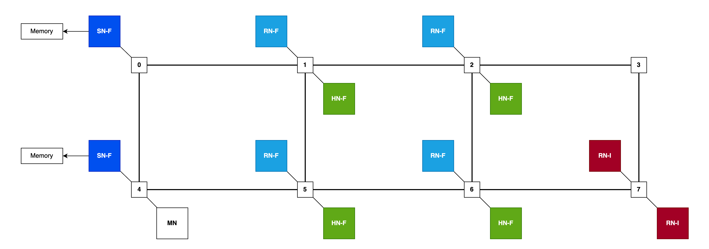


## Mapping gem5 Resources to CHI Topology

When we invoke gem5 via the Syscall Emulation wrapper script, se.py we pass parameters and these get mapped by the CHI configuration logic into a specific topology.    In some cases there may not always be a perfect match between the resources specified on invocation and the topology described for the interconnect so the mapping process will fill available slots, like mapping gem5 CPU instances to CHI RN-f nodes.


| Option         | Example              | Meaning                                                  |
| -------------- | -------------------- | -------------------------------------------------------- |
| --cpu-type     | RiscvTimingSimpleCPU | type of CPU to model - simple, in-order, out-of-order    |
| --topology     | CustomMesh           | interconnect topology to use                             |
| --chi-config   | 2x4.py               | topology configuraiton specifying location of node types |
| --num-cpus     | 4                    | Number of CPUs, maps to CHI RN-Fs                        |
| --num-dirs     | 2                    | Number of coherency directories, maps to CHI HN-Fs       |
| --num-l3caches | 2                    | Number of system-level caches, maps to CHI HN-Fs         |


One thing that is not possible with the mapping system is being able to specify different latencies for different links.  We hoped that we could model some links as having higher latency to simulate a multi-die or multi-socket NUMA scenario.  This limitation is not inherent in gem5 or even in CHI support, it's only a limitation of the convenient mapping system provided.   It would be possible to more directly specify the configuration through customizing configuration scripts.


#### Note About Deprecation Warnings for se.py

Note: The gem5 scripts will warn that se.py is deprecated.  However for many configurations there are no alternatives in-tree that don't use se.py, specifically the CHI.py module which requires the command-line options and system construction from se.py.  If you try to avoid this you end up going on a wild goose chase and end up back to realizing that se.py is the only way to go until the in-tree configurations are rewritten.


# Thrasher Test Program

In order to ensure that interesting coherency traffic occurs we need a multi-processor environment where cores share data in the same cachelines.  We created a multi-threaded test case that is designed to generate coherency traffic by inducing false-sharing.

Using the C++ std::threading interface we created a test program that allocates a thread for each CPU where each thread repeatedly increments a 32-bit value in memory.  A parameter is defined to control the placement of this data to either induce or avoid false-sharing.

If we pack the values being incremented by CPUs together they will access the same cacheline to perform their read-modify-write to increment the value.  The memory layout and CPU accesses are depicted thusly:


By increasing the stride of allocations we can ensure that the data is located far enough away to reside on different cachelines:

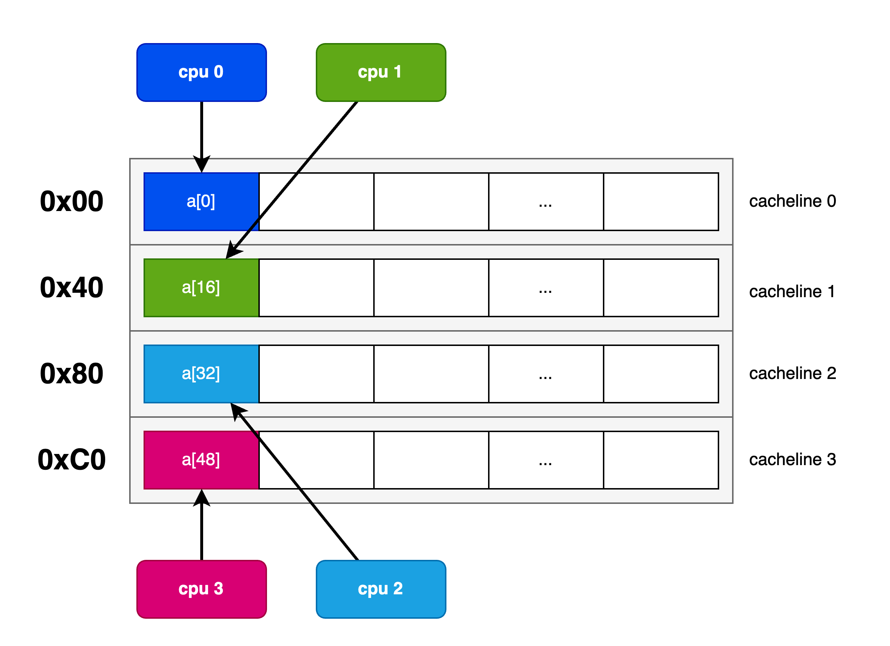

## Thrasher Invocation

The program accepts one argument which is the stride in memory for the respective 32-bit values.  A stride of 1 will pack the values together so that values shared by different CPUs will occupy one 64-byte cacheline.  (We can fit up to 16 CPUs worth of uint32/4-byte data in one 64-byte cacheline).

Alternatively, we can increase this stride to ensure that each CPU will access its own dedicated cacheline.  A stride value of 16 will pad the values to ensure that each 4B value will be spaced out 64B apart eliminating false sharing on the 64B-sized-cacheline architecture.  To verify proper placement, we print the address of each data element at the start of the test.

Here's a 4-core packed configuration with a stride of 1 to induce false sharing:
```
Running on 4 cores. with 10000 values and data stride of 1 uint32_t values
a[i] at address 0x 23c220
a[i] at address 0x 23c224
a[i] at address 0x 23c228
a[i] at address 0x 23c22c
```

And here's the padded config with a stride of 16 to avoid false sharing:
```
Running on 4 cores. with 10000 values and data stride of 16 uint32_t values
a[i] at address 0x 23c220
a[i] at address 0x 23c260
a[i] at address 0x 23c2a0
a[i] at address 0x 23c2e0
```

## Test Cases

### Configuration

We executed using gem5 SE with the CHI 2x4 mesh using 2 HN-Fs with caches.  Each CPU is a RiscvTimingSimpleCPU and each have their own L1 Data, L1 Instruction and Unified L2 caches.

| Config                             | Value        |
| ---------------------------------- | ------------ |
| cache_line_size                    |         64 B |
| system.cpuN.l1d.cache.size         | 64 KB, |
| system.cpuN.l1d.cache.assoc        | 2-way |
| system.cpuN.l1dicache.size         | 32 KB, |
| system.cpuN.l1dicache.assoc        | 2-way |
| system.cpuN.l2.cache.size          |   2MB |
| system.cpuN.l2.cache.assoc         |  8-way |
| system.ruby.hnfN.cntrl.cache.size  | 16MB |
| system.ruby.hnfN.cntrl.cache.assoc | 16-way |

Since our test will be focused on cache coherency thrashing, the sizes of caches are immaterial.  The cacheline size however is vital to understand the role of data placement and how it induces false sharing.

#### Memory Interleaving

The CHI configuration subsystem automatically configures address interleaving across HNFs as a function of cache line size (64B in our system) and the # of HNFs (2 in our system):

```
        # Create the HNFs interleaved addr ranges
        block_size_bits = int(math.log(cache_line_size, 2))
        llc_bits = int(math.log(len(hnfs), 2))
        numa_bit = block_size_bits + llc_bits - 1
        for i, hnf in enumerate(hnfs):
            ranges = []
            for r in sys_mem_ranges:
                addr_range = AddrRange(
                    r.start,
                    size=r.size(),
                    intlvHighBit=numa_bit,
                    intlvBits=llc_bits,
                    intlvMatch=i,
```

So we get:

> block_size_bits = log2(64) = 6
>
> llc_bits = log2(2) = 1
>
> numa_bit = 6 + 1 - 1 = 6

The interleaving is based on numa_bit (6) and routes to different HNFs based on this value - HNF0 gets transactions addresses where bit 6 is zero and HNF1 gets transactions whose address bit 6 is one.


### Permutations

We define 8 test permutations, varying the number of processors, and across either packed (stride 1) or padded (stride 16) configurations.

|   Case      | Cores | Stride |
| ----------- | ----- | ------ |
| 1c-stride1  |   1   |   1    |
| 2c-stride1  |   2   |   1    |
| 4c-stride1  |   4   |   1    |
| 8c-stride1  |   8   |   1    |
| 1c-stride16 |   1   |   16   |
| 2c-stride16 |   2   |   16   |
| 4c-stride16 |   4   |   16   |
| 8c-stride16 |   8   |   16   |


## Data Collected

To analyze the effect of coherency on CPU performance we collect CPU cycles and cycles per instruction (CPI) as we expect the CPU performance to reduce (more cycles, higher CPI) as coherency traffic increases.

We also capture counters for CHI coherency traffic at the HN-Fs, snoops to L2 cache and snoops to L1 d-cache.

|    Stat      | Reason                                                           |
| ------------ | ---------------------------------------------------------------- |
| Cycles       | Compare processor performance reduction due to coherency traffic |
| CPI          | Compare processor performance reduction due to coherency traffic |
| L1/L2 Snoops | Compare amount of coherency traffic across different strides     |
| HNF Snoops   | Examine coherency traffic as well as HN-F SAM effects            |


# Test Results

We examine the CPU performance as measured across eight workloads representing the permutations of CPU core count and data stride inducing false-sharing.  We use total CPU cycles as a measure of performance as the same work is being done in all cases, so additional CPU cycles reveal time the CPU spends waiting for data.

Figure 1 depicts how CPU cycles increase in proportion to the number of CPU cores when false-sharing is induced.  When false-sharing is avoided we see the CPU cycle counts remain constant across CPU core counts.  This data demonstrates the significance of coherency on CPU performance.  It doesn't matter how large or how plentiful the caches are, if shared data is placed poorly performance will suffer dramatically.

| 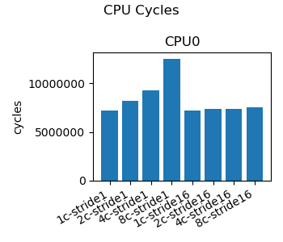 |
| :--: |
| Figure 1: CPU Cycles |

We examine traffic to the CPU L1 cache.  We focused on CPU0 as we expect similar traffic patterns across all CPUs given the symmetric nature of the workload.  This traffic reveals a stark contrast between the false-sharing and the no-false-sharing cases.

In Figure 2 the left three charts reflect outbound traffic from the L1 d-cache, from the CPU towards the interconnect.  The right two charts reflect inbound traffic to the L1 d-cache from the interconnect towards the CPU.

The SendReadShared is the response to a ReadShared transaction from the interconnect indicating another core is performing the read portion of the read-modify-write.

The SendReadUnique is the response to a ReadUnique transaction from the interconnect indicating preparation for a write where the data did not already exist in the cache of the requesting CPU.  Why would this be the case during a read-modify-write?  Another CPU can take ownership of the cacheline to do a write between this CPU's read and write such that the write causes a ReadUnique.

The SendCleanUnique is the response to a CleanUnique from the interconnect indicating preparation for a write where the data already existed in the requesting CPU cache in a Shared state.  This reflects the upgrade in the read-modify-write sequence where the requesting CPU managed to retain the cacheline across the read and write.


|  |
| :--: |
| Figure 2: L1 D-Cache Traffic |

In essence we are seeing two modes due to the timing of concurrent execution, one where the read-modify-write occurs with the cacheline remains resident in the originating CPU's L1 data cache for the duration of the RmW operation and another mode where the cacheline is migrated in the middle of the RmW operation.

Note that we do see some surprising variations per-core which we suspect is due to other CPU caches holding data given the timing of cacheline movement.  We suspect that other CPUs will account for the missing data but this could not be confirmed at the time of writing.


| 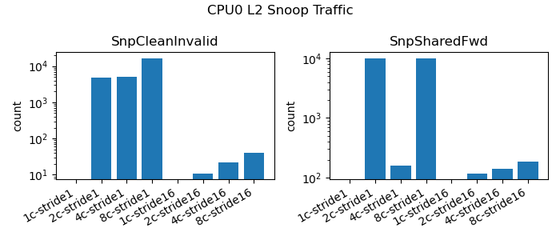 |
| :--: |
| Figure 3: L2 Snoop Traffic |

The L2 snoop traffic depicted in Figure 3 matches the snoop traffic we see to L1.  This makes  sense as the working set of this simply coherency test does not make use of L2 cache for capacity purposes.  Instead the L2 only serves as a hop along the way for coherency traffic.

| 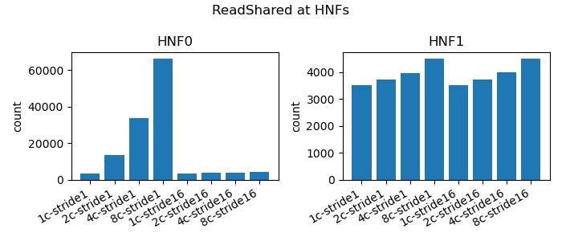 |
| :--: |
| Figure 4: HNF ReadShared Traffic |

Although the Home Nodes contain system-level (L3) caches, again as our working set is so small these are not used for storing data.  But the Home Nodes do serve as directories for main memory and we see that effect as the majority of traffic targets HNF0.  (Be sure to check the y-axis on the HNF0 and HNF1 charts as they vary by two orders of magnitude!)

Why HNF0?  Recall that memory is interleaved across HNFs at a 64B granularity.  With our data placement at:

stride-1:
```
a[i] at address 0x 23c220
a[i] at address 0x 23c224
a[i] at address 0x 23c228
a[i] at address 0x 23c22c
```

stride-16:
```
a[i] at address 0x 23c220
a[i] at address 0x 23c260
a[i] at address 0x 23c2a0
a[i] at address 0x 23c2e0
```

We can see in all cases that bit 6 is zero (0x20 -> 0b0**0**10_0000) so all accesses, for both packed and padded cases.  For this workload HNF interleave has no direct bearing on the result but it allows us to collect the coherency traffic counts under one node.

| 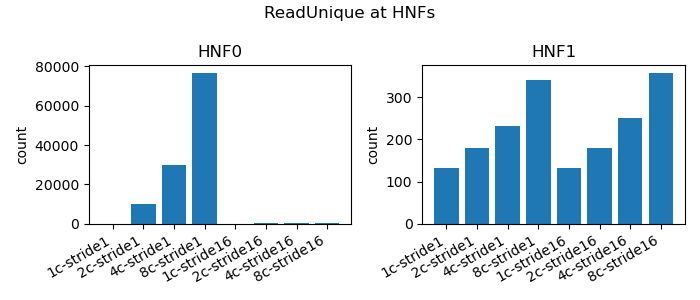 |
| :--: |
| Figure 5: HNF ReadUnique Traffic |

As discussed when we analyzing the L1 data cache snoop traffic, we see both ReadUnique and CleanUnique reflecting the two modes of operation, intact RmW and split RmW sequences.

| 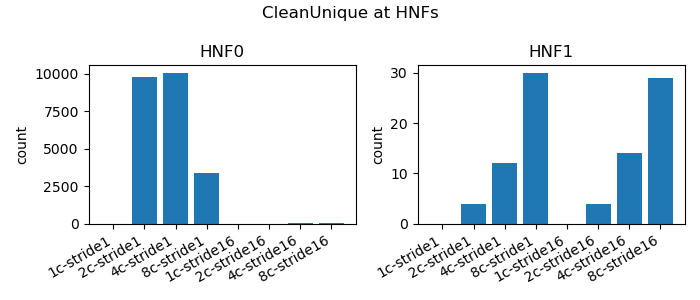 |
| :--: |
| Figure 5: HNF CleanUnique Traffic |


# Conclusion

We were able to comprehend the Coherent Hub Interconnect protocol and interconnect topologies that arise from it.  We followed the evolution of CHI from basic peripheral interconnects to multi-requester interconnects, support for complex topologies and more performance traffic flows and eventually full system coherency.  Although the protocol is quite complex we can simplify our understanding by mapping to the five basic CHI coherency states and reasoning about how and why we transition between those states.

We found that with some effort gem5 can be configured for either Full System or Syscall Emulation modes, learned how to select the coherency protocol at build time, and learned about system call compatibility in SE mode.  The gem5 CHI building blocks allow us to model complex topologies and simulate multiprocessor workloads accordingly.  We did discover limitations of gem5 CHI topology mapping and a more flexible topology specification system is necessary for modeling more realistic topologies.

We developed a test program that generates coherency traffic and was able to illustrate through test workloads of varying core counts and shared data placement that we could capture coherency traffic and reason about differences in the data.


# Repo

The work for this project can be found at https://github.com/eugenecohen-osu/chi-gem5 which is a fork of gem5 with additional work on the chi branch.  The key steps to reproduce this is:

```
./docker-run build-riscv-chi.sh
./docker-run run-all.sh
```

Results for runs will appear in directory starting with the `out_` prefix with graphs generated in the `png` subdirectory.

# References

* AMBA APB Protocol Specification: https://developer.arm.com/documentation/ihi0024/latest/

* AMBA AHB Protocol Specification: https://developer.arm.com/documentation/ihi0033/latest/

* AMBA AXI and ACE Protocol Specification: https://documentation-service.arm.com/static/
5f915b62f86e16515cdc3b1c

* AMBA CHI Architecture Specification: https://developer.arm.com/documentation/ihi0050/latest/

* What is AMBA?: https://www.youtube.com/watch?v=CZlDTQzOfq4

* ARM® CoreLink CCI-400 Cache Coherent Interconnect: https://documentation-service.arm.com/static/5e8f15d57100066a414f73ce

* Arm CoreLink CCI-550 Cache Coherent Interconnect: https://documentation-service.arm.com/static/5e7dd450cbfe76649ba52b0c

* gem5 git: https://github.com/gem5/gem5

* gem5 documentation: https://www.gem5.org/documentation/

